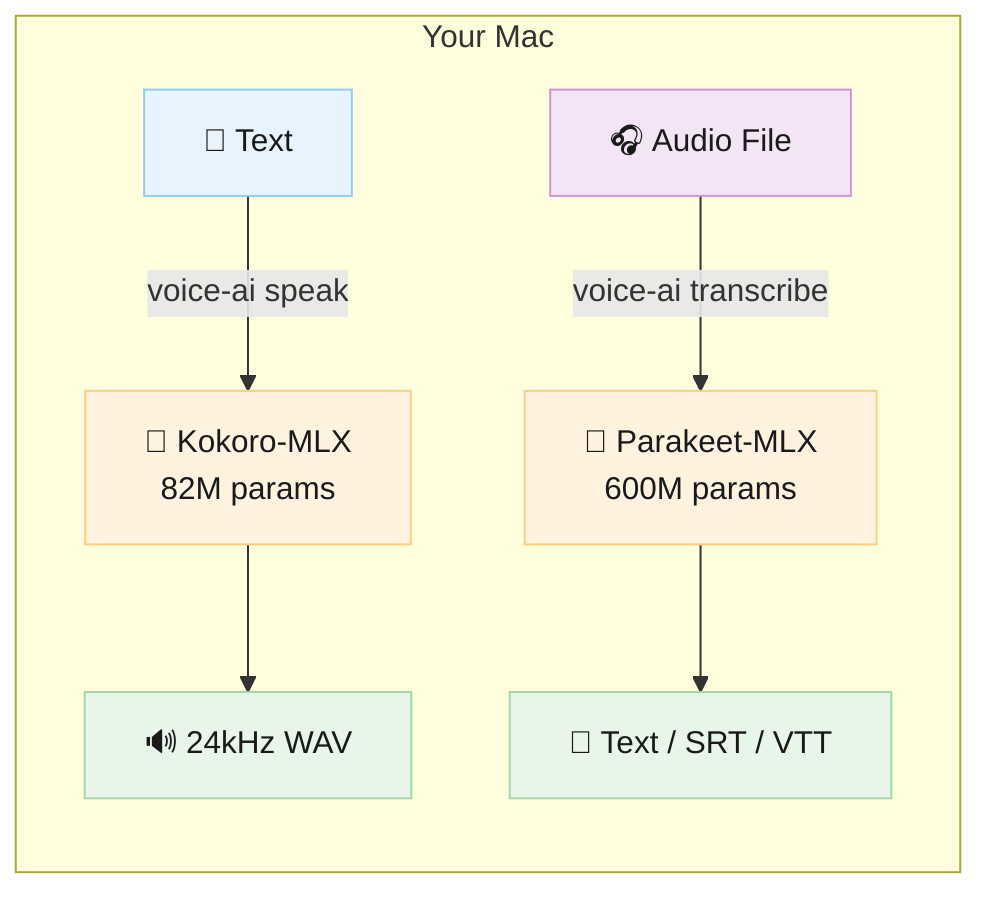
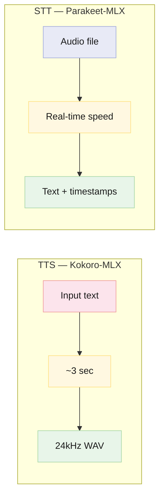
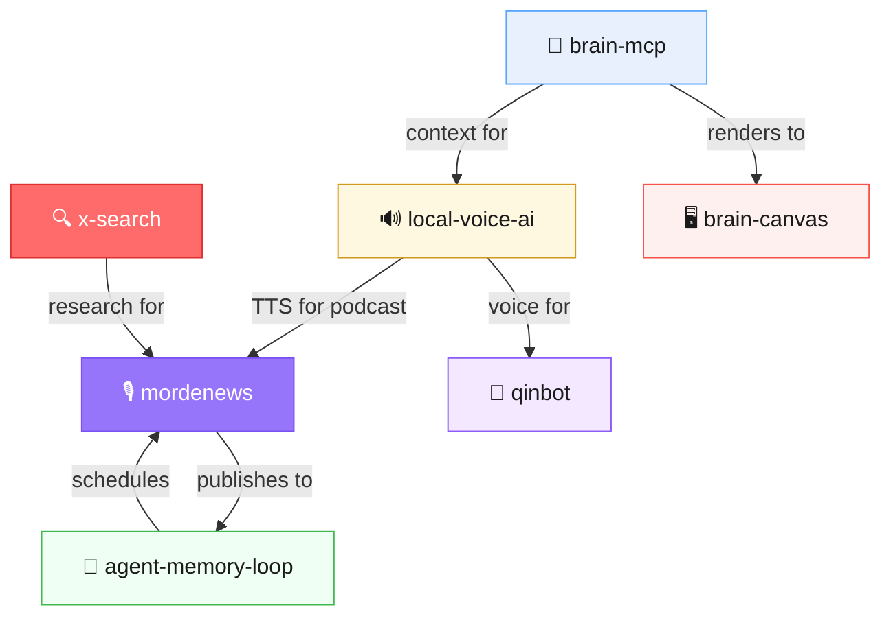

# 🎙️ local-voice-ai

**Local voice AI for Apple Silicon — TTS + STT, no cloud, no API keys.**

Turn text into speech and speech into text, entirely on your Mac. Both models run on the Apple Neural Engine via [MLX](https://github.com/ml-explore/mlx) — no GPU rental, no API costs, no data leaving your machine.

```
pip install local-voice-ai
voice-ai speak "The future of voice is local"
```

That's it. Three seconds later you have a WAV file.

---

## How it works



Two models. Two commands. Zero cloud dependencies.

| | TTS (Kokoro-MLX) | STT (Parakeet-MLX) |
|---|---|---|
| **Model** | Kokoro-82M-bf16 | parakeet-tdt-0.6b-v2 |
| **Parameters** | 82M | 600M |
| **Speed** | ~3 seconds | Real-time or faster |
| **Memory** | 1.6 GB | ~2 GB |
| **Languages** | English (US/UK) | 25 languages, auto-detect |
| **Output** | 24kHz mono WAV | Text, SRT, VTT, JSON |

---

## Quick Start

### Install

```bash
pip install local-voice-ai
```

> **Requires:** macOS with Apple Silicon (M1/M2/M3/M4), Python 3.10+

### Speak

```bash
# Default voice (am_michael @ 1.6x)
voice-ai speak "Hello from your local AI"

# Pick a voice
voice-ai speak "This is lovely" --voice af_heart

# Generate and play immediately
voice-ai speak "Listen to this" --play

# Custom output path
voice-ai speak "Save me" -o ~/Desktop/greeting.wav
```

### Transcribe

```bash
# Basic transcription
voice-ai transcribe recording.mp3

# Subtitles with word-level timestamps
voice-ai transcribe lecture.wav --format srt --word-timestamps

# Higher accuracy with beam search
voice-ai transcribe interview.mp3 --beam-size 3

# Auto-detect language (25 supported)
voice-ai transcribe japanese_audio.wav
```

### Python API

```python
from local_voice_ai import speak, transcribe, list_voices

# Text to speech
wav_path = speak("Hello world", voice="af_heart", speed=1.4)

# Speech to text
text = transcribe("recording.mp3")
subtitles = transcribe("video.mp4", output_format="srt", beam_size=3)

# See all voices
for name, info in list_voices().items():
    print(f"{name}: {info['gender']}, {info['quality']}")
```

---

## Voices

| Voice | Gender | Accent | Quality | Notes |
|-------|--------|--------|---------|-------|
| `af_heart` | Female | American | ⭐⭐⭐⭐⭐ A | Warmest, most natural |
| `af_bella` | Female | American | ⭐⭐⭐⭐ A- | Clear, slightly brighter |
| `bf_alice` | Female | British | ⭐⭐⭐⭐⭐ A | Crisp British accent |
| `am_fenrir` | Male | American | ⭐⭐⭐ C+ | Deeper, rougher edges |
| `am_michael` | Male | American | ⭐⭐⭐ C+ | **Default** — solid all-rounder |

> Female voices are noticeably higher quality in the current Kokoro model. If quality matters more than voice gender, use `af_heart`.

---

## Performance

Measured on M4 MacBook Pro:



| Metric | TTS | STT |
|--------|-----|-----|
| First-run latency | ~10s (model download) | ~10s (model download) |
| Steady-state | **~3 seconds** | **Real-time or faster** |
| Memory | 1.6 GB | ~2 GB |
| Model size on disk | ~160 MB | ~1.2 GB |
| Max input | ~2000 chars | Hours of audio (120s chunks) |

Models are cached in `~/.cache/huggingface/` after first run. No re-download needed.

---

## vs. Cloud Alternatives

Why run this locally instead of hitting an API?

| | local-voice-ai | ElevenLabs | OpenAI TTS | Whisper API | Deepgram |
|---|---|---|---|---|---|
| **Cost** | Free forever | $5-330/mo | $15/1M chars | $0.006/min | $0.0043/min |
| **Latency** | ~3s on-device | 1-5s + network | 1-3s + network | 2-10s + network | 1-3s + network |
| **Privacy** | 100% local | Cloud | Cloud | Cloud | Cloud |
| **Offline** | ✅ Works on airplane | ❌ | ❌ | ❌ | ❌ |
| **API key** | None needed | Required | Required | Required | Required |
| **Quality** | Good (82M model) | Excellent | Very good | Excellent | Very good |
| **Setup** | `pip install` | Account + key | Account + key | Account + key | Account + key |

**The trade-off is honest:** Cloud TTS (especially ElevenLabs) sounds better. But local-voice-ai is free, private, instant, and good enough for most use cases — drafts, prototyping, accessibility, personal tools, automation.

---

## STT Details

Parakeet-MLX supports 25 languages with automatic detection:

```
English, Spanish, French, German, Italian, Portuguese, Dutch, Russian,
Chinese, Japanese, Korean, Arabic, Hindi, Turkish, Polish, Czech,
Ukrainian, Romanian, Hungarian, Finnish, Swedish, Norwegian, Danish,
Greek, Hebrew
```

### Output Formats

```bash
# Plain text (default)
voice-ai transcribe audio.mp3

# SRT subtitles
voice-ai transcribe audio.mp3 -f srt

# VTT subtitles with word highlighting
voice-ai transcribe audio.mp3 -f vtt --word-timestamps

# JSON with metadata
voice-ai transcribe audio.mp3 -f json
```

### Long Audio

Parakeet-MLX automatically chunks audio into 120-second segments. Files over an hour work fine — just pass them in:

```bash
voice-ai transcribe 2-hour-lecture.mp3
```

For very long files (>1hr), parakeet-mlx supports `--local-attention` to reduce memory usage.

---

## Project Structure

```
local-voice-ai/
├── local_voice_ai/
│   ├── __init__.py    # Public API: speak, transcribe, list_voices
│   ├── tts.py         # Kokoro-MLX TTS wrapper
│   ├── stt.py         # Parakeet-MLX STT wrapper
│   └── cli.py         # Unified CLI (voice-ai command)
├── tests/
│   ├── test_tts.py
│   ├── test_stt.py
│   └── test_cli.py
├── pyproject.toml
├── LICENSE            # MIT
└── README.md
```

---

## Development

```bash
git clone https://github.com/mordechaipotash/local-voice-ai
cd local-voice-ai
pip install -e ".[dev]"
pytest
```

---

## 🔗 Part of the AI Agent Ecosystem

local-voice-ai is the voice layer in a modular AI agent stack — powering the MordeNews daily podcast (TTS for all segments) and QinBot (voice on a dumb phone).



| Repo | What | Stars |
|------|------|-------|
| [brain-mcp](https://github.com/mordechaipotash/brain-mcp) | Memory — 25 MCP tools, cognitive prosthetic | ⭐ 17 |
| [brain-canvas](https://github.com/mordechaipotash/brain-canvas) | Visual display for any LLM | ⭐ 11 |
| **[local-voice-ai](https://github.com/mordechaipotash/local-voice-ai)** | **This repo** — Kokoro TTS + Parakeet STT, zero cloud | ⭐ 1 |
| [agent-memory-loop](https://github.com/mordechaipotash/agent-memory-loop) | Maintenance — cron, context windows, STATE.json | ⭐ 1 |
| [x-search](https://github.com/mordechaipotash/x-search) | Search X/Twitter via Grok, no API key | 🆕 |
| [mordenews](https://github.com/mordechaipotash/mordenews) | Automated daily AI podcast | 🆕 |
| [qinbot](https://github.com/mordechaipotash/qinbot) | AI on a dumb phone — no browser, no apps | ⭐ 1 |

---

## Credits

Built on two excellent MLX projects:
- **[mlx-audio](https://github.com/lucasnewman/mlx-audio)** — MLX port of Kokoro TTS
- **[parakeet-mlx](https://github.com/senstella/parakeet-mlx)** — MLX port of NVIDIA Parakeet STT

Both run natively on Apple Silicon via [MLX](https://github.com/ml-explore/mlx) from Apple.

## License

MIT — do whatever you want with it.
